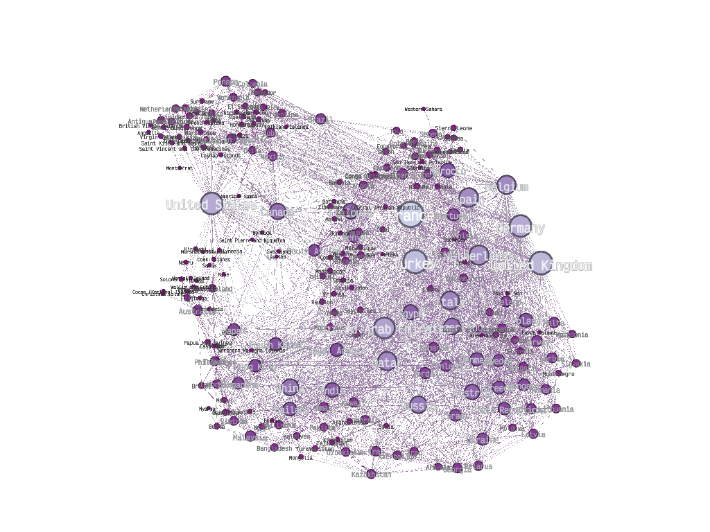
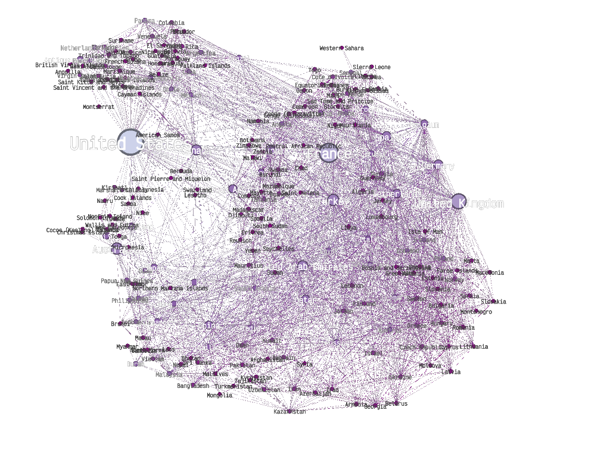

# Teoría de Algoritmos II (75.30)
## Trabajo Práctico 1 – 25/09/2023 - Fecha de Entrega: 20/10/2023

### **1**

La red es un grafo no dirigido que modela las conexiones entre aeropuertos. Tiene un grado promedio de 24.908, lo que significa que cada aeropuerto está conectado directamente a aproximadamente 25 otros aeropuertos. El diámetro de la red es 5, lo que indica que la mayor cantidad de aeropuertos que tendría uno que atravesar para ir de un aeropuerto a otro (por el camino más corto) es 5. Además, el coeficiente medio de clustering es 0.687, lo que sugiere una alta probabilidad de que los aeropuertos conectados entre sí también estén conectados con los mismos aeropuertos.  
  
  

### **2**

#TODO

### **3**

Betweenness centrality mide la cantidad de rutas más cortas en las que se encuentra un nodo. En el contexto de una red de aeropuertos, un nodo con alta centralidad sería un aeropuerto que aparece frecuentemente en las rutas más cortas entre otros aeropuertos. Indicando que es un aeropuerto importante en la red.

Por ejemplo, los aeropuertos en países como EE.UU., Francia o Reino Unido, tienen una alta centralidad debido a su ubicación estratégica y la cantidad de conexiones (que permiten vuelos) que manejan.

Además, esta medida puede ayudar a identificar aeropuertos que, aunque no tengan muchas conexiones directas (grado bajo), son cruciales para mantener la red conectada y permitir viajes eficientes entre diferentes aeropuertos. Por ejemplo, un aeropuerto en Antigua y Barbuda puede no tener tantas conexiones directas como un aeropuerto en EE.UU. pero aún así puede ser crucial para conectar rutas en el Caribe.

Un caso interesante es el de Birmania (Myanmar) e India. Aunque Birmania puede tener muchas menos aristas (conexiones directas) que India, ambos pueden tener una importancia similar en términos de centralidad. Esto se debe a que Birmania puede estar situada en muchas rutas ya que de otra forma no se podría llegar a determinados lugares o sería más costoso, lo que aumenta su centralidad a pesar de tener menos conexiones directas.

A continuación se pueden ver cuáles son los aeropuertos más importantes rankeados por la métrica de Betweenness Centrality:
1. Estados Unidos
2. Francia (obvio)
3. Reino Unido
4. Australia - Turquía - Canada
5. España - Alemania - Emiratos Árabes Unidos



### **4**

El código utilizado para generar las simulaciones y la representación de anonymous walks se encuentra en el archivo ```lib.py```. En el archivo ```main_4.py```, se llevan a cabo ambas simulaciones para posteriormente obtener una representación de sus anonymous walks para un número de nodos definido. Finalmente, se imprimen los resultados de la comparación entre las dos simulaciones utilizando la distancia del coseno. A continuación se muestran dos resultados obtenidos para anonymous walks de 4 nodos (se intentó correr con más pero la pc no aguantó).
```
Grafo cargado ✔
Simulación de un modelado de Erdös-Rényi ✔
Simulación de un modelado de Preferential Attachment (ley de potencias) ✔
Representación de anonymous walks de la red original (largo de 4 nodos) ✔
Representación de anonymous walks del modelado de Erdös-Rényi (largo de 4 nodos) ✔
Representación de anonymous walks del modelado de Preferential Attachment (largo de 4 nodos) ✔
Distancia coseno entre la red original y el modelado de Erdös-Rényi: 1.9809632645362285e-05
Distancia coseno entre la red original y el modelado de Preferential Attachment: 1.19460069303301e-05
```
```
Grafo cargado ✔
Simulación de un modelado de Erdös-Rényi ✔
Simulación de un modelado de Preferential Attachment (ley de potencias) ✔
Representación de anonymous walks de la red original (largo de 4 nodos) ✔
Representación de anonymous walks del modelado de Erdös-Rényi (largo de 4 nodos) ✔
Representación de anonymous walks del modelado de Preferential Attachment (largo de 4 nodos) ✔
Distancia coseno entre la red original y el modelado de Erdös-Rényi: 1.822514983851331e-05
Distancia coseno entre la red original y el modelado de Preferential Attachment: 1.0725389349652836e-05
```
```
Grafo cargado ✔
Simulación de un modelado de Erdös-Rényi ✔
Simulación de un modelado de Preferential Attachment (ley de potencias) ✔
Representación de anonymous walks de la red original (largo de 4 nodos) ✔
Representación de anonymous walks del modelado de Erdös-Rényi (largo de 4 nodos) ✔
Representación de anonymous walks del modelado de Preferential Attachment (largo de 4 nodos) ✔
Distancia coseno entre la red original y el modelado de Erdös-Rényi: 1.7410003666507023e-05
Distancia coseno entre la red original y el modelado de Preferential Attachment: 1.2337893790403953e-05
```

Se puede ver que ambas simulaciones tienen una distancia del coseno muy baja con respecto a la red original, lo que indica que son buenas simulaciones. Sin embargo, la simulación de Erdös-Rényi tiene una distancia del coseno mayor que la de Preferential Attachment, lo que indica que la simulación de Preferential Attachment es mejor.  

### **5**
#TODO

### **6**
El código utilizado para detectar los roles se encuentra en ```lib.py```. En el archivo ```main_4.py```, se lleva a cabo dicha detección para un número de roles definido. Finalmente, se guardan los resultados en un archivo con los nodos separados por roles. A continuación se muestran algunos resultados obtenidos para distintas cantidades de roles.  

**2 roles**  
En un rol se encuentran `Hong Kong, Japan, Singapore, China, Denmark, Finland, Norway, Netherlands, Sweden, United States, Belgium, France, Germany, United Kingdom, Canada, Switzerland, Spain, Ireland, Hungary, Poland, Latvia, Austria, Czech Republic, Jordan, United Arab Emirates, Dominican Republic, Cuba, Mexico, Italy, Brazil, South Korea, Turkey, Israel, Morocco, Taiwan, Ethiopia, Egypt, Qatar, Portugal, Russia, Saudi Arabia, Greece, India, Ukraine, Malta, Nigeria, Kenya, South Africa, Thailand, Uzbekistan`, se puede observar que son mayoritariamente los aeropuertos de mayor importancia de la red, de hecho el promedio de grados del rol es de 61,84 (si bien el grado no explica todo, ayuda a tener un contexto para entender mejor la agrupación). El resto de aeropuertos, menos importantes, quedaron en el segundo rol.

**4 roles**  
Para la división en 4 roles, se obtuvo lo siguiente:
- Un rol con los aeropuertos más importantes (`Australia, Hong Kong, Japan, Singapore, China, Denmark, Finland, ...`)
- Un rol con aeropuertos chicos (`Papua New Guinea, Solomon Islands, Micronesia, Greenland, Aruba, Cayman Islands, ...`)
- Un rol con aeropuertos de importancia media (`Colombia, Cuba, Mexico, Martinique, Bahamas, Brazil, Jamaica, Peru, Costa Rica, ...`)
- Un rol con aeropuertos de importancia media, tendiendo a chica, (`Luxembourg, Slovakia, Cyprus, Montenegro, Slovenia, Estonia, Macedonia, Bosnia and Herzegovina, ...`)

### **7**

#TODO