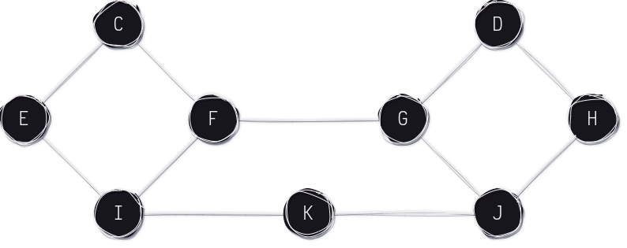

# Teoría de Algoritmos II (75.30)
## Trabajo Práctico 2 – 30/10/2023 - Fecha de Entrega: 27/11/2023

### **1**

Se quiere convocar a una elección a la que se presentan 4 candidatos (A, B, C y D). Hay 3 votantes del jurado que tienen sus siguientes rankings individuales:  
$$
Jurado\; 1: B \succ C \succ D \succ A \newline
Jurado\; 2: C \succ D \succ A \succ B \newline 
Jurado\; 3: D \succ A \succ B \succ C \newline
$$

***Eliminación iterativa***  
En cada iteración se elimina el candidato con menor cantidad de votos.

_Iteración 1_  
$
A: 0 \newline
B: 1 \newline
C: 1 \newline
D: 1 \newline
\rightarrow Se\; elimina\; A.
$  
$
Jurado\; 1: B \succ C \succ D \newline
Jurado\; 2: C \succ D \succ B \newline 
Jurado\; 3: D \succ B \succ C \newline
$

_Iteración 2_  
$
\rightarrow\; Todos\; los\; candidatos\; tienen\; la\; misma\; cantidad\; de\; votos.\; No\; se\; elimina\; ningún\; candidato.
$

***Borda Rule***  
Se asigna un puntaje a cada candidato según la posición en la que se encuentra en el ranking de cada votante.
Asumo que son 3 puntos para el primero, 2 para el segundo, 1 para el tercero y 0 para el cuarto.  
$
A = 0 + 1 + 2 = 3 \newline
B = 3 + 0 + 1 = 4 \newline
C = 2 + 3 + 0 = 5 \newline
D = 1 + 2 + 3 = 6 \newline
\rightarrow Gana D.
$

***Buscando que gane A -> Eliminaciones sucesivas***  
Se eliminan los candidatos en rondas de a pares de candidatos. Asume que si un candidato gana en un enfrentamiento contra otro candidato B, ganaría también contra todos los candidatos que ganó el candidato B.  
Orden de rondas: D C B A

_Ronda 1: D contra C_  
$
Jurado\; 1: Gana C \newline
Jurado\; 2: Gana C \newline
Jurado\; 3: Gana D \newline
\rightarrow Gana C.
$

_Ronda 2: C contra B_  
$
Jurado\; 1: Gana B \newline
Jurado\; 2: Gana C \newline
Jurado\; 3: Gana B \newline
\rightarrow Gana B.
$

_Ronda 3: B contra A_  
$
Jurado\; 1: Gana B \newline
Jurado\; 2: Gana A \newline 
Jurado\; 3: Gana A \newline
\rightarrow Gana A.
$

Al ganar A no se está cumpliendo la propiedad de ser Pareto-Eficiente ya que el orden relativo $D \succ A$, presente en las preferencias de cada uno de los jurados, no se respeta en el resultado.  

### **2**

Dado el modelo de cascada de información visto en clase. A partir de ahora llamamos $T$ a la nueva tecnología. Vamos a analizar como actúan los individuos de la red ante una nueva tecnología. Cada individuo puede aceptar o rechazar $T$. Si acepta, recibe una ganancia $g$ aleatoria que puede ser positiva o negativa. Si rechaza, recibe una ganancia $g=0$.

Si $T = "Mala".$ Entonces sabemos que el promedio de ganancias entre los que aceptaron $T$ será **negativo**. De esta forma, que el primer individuo que acepte la tecnología, seguramente tendra una ganancia negativa. Luego, los siguientes individuos podran aceptar $T$ o rechazarla, conociendo las ganancias de los demás y sabiendo el promedio de las mismas. Si el promedio es negativo, entonces es más probable que un individuo a la hora de elegir, tenga preferencia por rechazar la tecnología en vez de aceptarla, lo cual "frena" la potencial formación de una cascada para que persista $T$. 

Podemos ver por ejemplo, que si los primeros individuos que acepten tienen malas experiencias $(g<0)$, cada vez es menos probable que los siguientes acepten la tecnologia, pudiendo llegar al punto de formar una cascada de Rechazo, si la cantidad de malas experiencias (o la importancia de las mismas) es suficiente. 

Esto se corresponde con lo que experimentamos en la realidad. Si un solo amigo mío probó un juego nuevo y no le gustó, quizás me desanime a probarlo, pero aún es posible que le de una oportunidad. En cambio si muchos/todos mis amigos tuvieron malas experiencias, probablemente ni siquiera pruebe el juego.

Por otro lado, si $T = "Buena"$. Entonces cuando un individuo deba elegir, va a notar que en promedio, las ganancias/experiencias de los que adoptaron $T$ antes son más positivas que negativas, lo que nos incentiva a Aceptar esta nueva tecnología. Podemos pensar también, que la primer persona que acepte $T$ tendra una ganancia positiva, por lo que la persona siguiente probablemente optará por aceptarla también. Y aunque algunos individuos hayan tenido malas experiencias (ganancias negativas), habrá mayor tendencia a adoptar la nueva tecnología por ser "Buena" que a rechazarla.

De esta forma, vemos que no debería/es poco probable que surja una cascada de rechazo si la tecnología es Buena. 

### **3**

Considerando la siguiente red, en donde cada nodo tiene inicialmente un comportamiento B:  

Suponemos a E y F como _early adopters_ del comportamiento A (marcado en violeta). Y que el resto de nodos adoptará este comportamiento sólo si al menos la mitad de sus vecinos lo adoptan.  

A continuación se muestra la secuencia en la que adoptan el comportamiento A los nodos restantes.  

Finalmente, se llega a que ni G ni J logran adoptar este nuevo comportamiento, dado que ambos tienen 3 vecinos de los cuales sólo 1 adoptó el comportamiento A. De esta forma, tampoco será posible que D o H adopten el comportamiento A, ya que ambos tienen 2 vecinos que no lo adoptaron.  

El comportamiento de A no se propaga por toda la red dado que la situación inicial presentaba dos clusters, en donde sólo el cluster izquierdo poseía _early adopters_. De esta forma, la información sobre la existencia del comportamiento A llegó a algunos nodos del cluster derecho mediante puentes/lazos débiles, pero sin alcanzar la cantidad mínima de vecinos que debían adoptar el comportamiento para que estos nodos también lo adopten.  
De esta forma, para que el comportamiento A se expanda por el resto de la red, otro _early adopter_ debería estar presente en el cluster derecho para que el comportamiento A se propague por toda la red. Más aún, el _early adopter_ podría ser cualquier nodo del cluster derecho.  

### **4**

#TODO  

### **5**

#TODO  