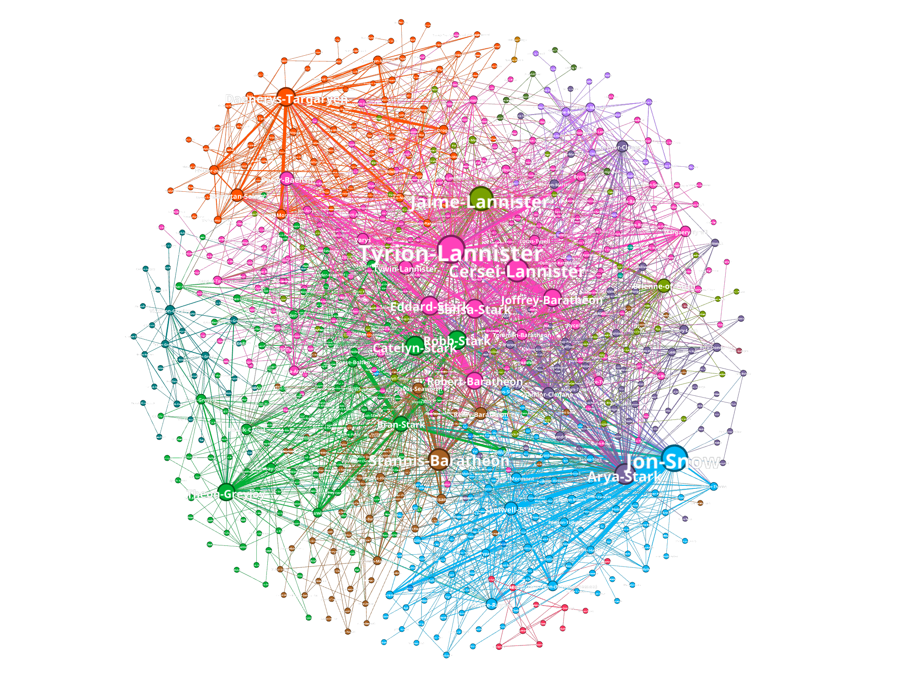

# Teoría de Algoritmos II (75.30)
## Trabajo Práctico Final

### Integrantes
- [107205 - Eliana Harriet](https://github.com/ElianaHarriet)
- [107754 - Marcos Bat Mentzel](https://github.com/marcosbatm)

### Origen de los datos


Los datos utilizados para la realización del trabajo práctico fueron obtenidos del repositorio de GitHub [mathbeveridge/asoiaf](https://github.com/mathbeveridge/asoiaf/blob/master/data/asoiaf-all-edges.csv). Puntualmente, se utilizó el csv que genera el grafo con todas las aristas a lo largo de todos los libros de la saga (exactamente el archivo al que dirige el link).  
Tal como dice el README del repositorio, una arista conecta dos personajes cada vez que sus nombres (o apodos) aparecían con una diferencia de hasta 15 palabras entre sí en uno de los libros de "Canción de hielo y fuego". El peso de la arista corresponde al número de interacciones.  

### A song of ice and fire
A Song of Ice and Fire es una saga de novelas de fantasía épica escrita por el autor estadounidense George R. R. Martin. Si bien la saga se encuentra inconclusa, hasta el momento el tronco principal de la historia se compone de 5 libros: A Game of Thrones, A Clash of Kings, A Storm of Swords, A Feast for Crows y A Dance with Dragons. A lo largo de dichos libros se narra una historia en donde hubo lugar a muchos giros importantes en la historia, como cambios de bando, asesinatos, traiciones y demas eventos que permite una red de personajes lo suficientemente compleja como para ser analizada.  


### Objetivo
La saga de A Song of Ice and Fire cuenta con una gran cantidad de personajes y sucesos, derivando en una baja probabilidad de preveer que sucederá en el futuro. Sin embargo, es posible analizar la red de personajes y sus interacciones para obtener información sobre la misma.  
De esta forma, el objetivo del trabajo práctico es analizar la red de personajes de la saga a fin de obtener información relevante ya sea a modo compañamiento de la lectura de los libros o para obtener información extra que pudo haber pasado desapercibida.

> **Aviso de Spoilers**: El trabajo práctico contiene información sobre los libros de la saga, por lo que se recomienda no leerlo si no se leyeron todos los libros publicados hasta el momento.

---

## Análisis de la red de personajes


Se trata de un grafo no dirigido con 796 nodos (personajes) y 2823 aristas (apariciones cercanas en los libros). Además, la densidad de la red es de 0.009, lo cual nos demuestra que la red es bastante dispersa.  

Al momento de calcular información respectiva a los grados del grafo se puede obtener lo siguiente:
```
 -> Minimum degree: 1
 -> Maximum degree: 122
 -> Average degree: 7.093
 -> Median degree: 3.0
```
Se puede observar que el grado promedio es mayor al grado mediano, lo que indica que la distribución de los grados no es simétrica. Esto significa que la mitad de los nodos tienen un grado menor o igual a 3, lo cual es bastante bajo y, sumado a que el promedio de grados es de 7, se puede ver la disparidad entre las conexiones de los personajes.  

El diámetro de la red es de 9, algo llamativo para una red tan grande de personajes. En los libros se plantea que el mundo es muy grande y que los personajes se encuentran muy lejos unos de otros (lo cual se condice con la densidad obtenida), además de aparentar tener burbujas bastante aisladas y tenemos el dato recién obtenido sobre la gran cantidad de nodos poco conectados. Sin embargo, el diámetro de la red es muy bajo, lo que indica que cada conexión en sí adquiera mayor importancia, permitiendo que la información viaje de un lado a otro con relativa facilidad.  

## Las casas de Westeros


Al principio de la saga se nos plantean distintas casas, cada una con sus características, fortalezas, miembros ubicaciones y alianzas. Uno podría pensar que las casas son un grupo de personajes que se encuentran muy conectados entre sí, pero la realidad es que no es así, a medida que avanza la historia la única constante es ir perdiendo o separando miembros de las casas. Esto último puede verse en el siguiente gráfico:  


El grafo presentado es un grafo coloreado según el cluster al que pertenece cada personaje, siendo la cantidad de grupos y el grupo a asignar determinado por el algoritmo de Louvain (hecho mediante herramientas de gephi).  

Para ver un poco más en detalle, vamos a analizar la primer casa que nos presentan en la saga, los Stark:
Esta casa es una familia noble del norte de Westeros, que gobierna en Invernalia y cuyo emblema es un lobo huargo. Dada la ubicación de la misma, se podría pensar que los miembros de la misma se encuentran muy conectados entre sí y desconectados del resto de los personajes, dado lo lejos que se encuentran de la capital y lo fuerte que resulta el invierno en el norte. Sin embargo, esto no es así, y tomaremos como ejemplo a los hermanos Stark:
- Robb Stark: es el hijo mayor de Eddard Stark y Catelyn Tully. Es el heredero de Invernalia y el Norte.
- Sansa Stark: es la segunda hija de Eddard Stark y Catelyn Tully.
- Arya Stark: es la tercera hija de Eddard Stark y Catelyn Tully.
- Bran Stark: es el cuarto hijo de Eddard Stark y Catelyn Tully.
- Rickon Stark: es el hijo menor de Eddard Stark y Catelyn Tully.
- Jon Snow: en principio es el hijo bastardo de Eddard Stark y una mujer desconocida.  

Al momento de ubicar a estos seis hermanos en el grafo podemos verlos de la siguiente forma:  
  
En donde el ancho de la arista representa la cantidad de interacciones entre los personajes y el color del nodo es el cluster al que pertenece.  
Se puede ver cómo los seis hermanos están en cuatro clusters distintos, lo cual nos indica que no se encuentran muy conectados entre sí. Además, se puede ver que algunas aristas son bastante delgadas, lo cual nos indica que no se encuentran muy conectados algunos pares de hermanos entre sí.  
Siguiendo sobre la trayectoria de estos hermanos, vamos a mencionar un punto clave al principio de la historia: la muerte de Eddard Stark y cómo llegaron los hermanos a la misma:  
Tras la visita del rey Robert Baratheon a Invernalia, Eddard Stark es nombrado Mano del Rey y se ve obligado a viajar a Desembarco del Rey junto a sus hijas Sansa y Arya. Por otro lado, Jon Snow se une a la Guardia de la Noche y se dirige al Muro. Robb, Bran y Rickon se quedan en Invernalia, Robb debido a que es el heredero de Invernalia y el Norte, y Bran y Rickon por ser muy jóvenes. Esto nos deja con los siguientes clusters:
- Arya y Sansa en Desembarco del Rey
- Bran, Rickon y Robb en Invernalia
- Jon Snow en el Muro  

Pero tras la muerte de Eddard Stark, la posición de Arya y Sansa se ve comprometida, por lo que Arya se ve obligada a huir de Desembarco del Rey y Sansa queda prisionera de la familia Lannister. La casa Stark intentará a lo largo de la historia recuperar a sus hijas, sin embargo este grafo es una clara demostración de cómo no sólo no fue posible, sino que además las hermanas se fueron separando cada vez más. Veamos las conexiones de cada una de ellas:  
(insertar imágenes y analizarlas)

## centralidad

## agrupar personajes -> analizar comunidades (ej analizar la red según las casas) y roles

## analizar la red según los libros (ver la oportunidad de comparar la evolución entre distintos libros)

## etc