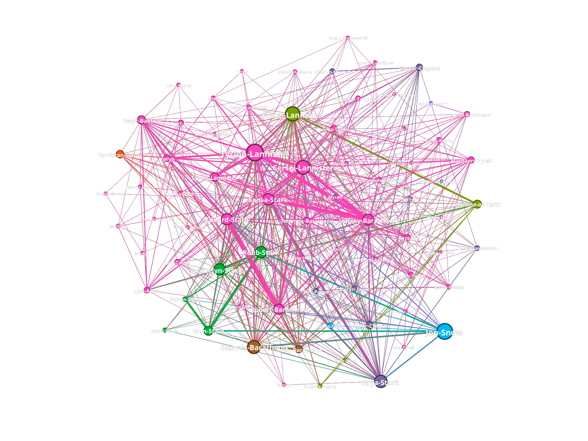
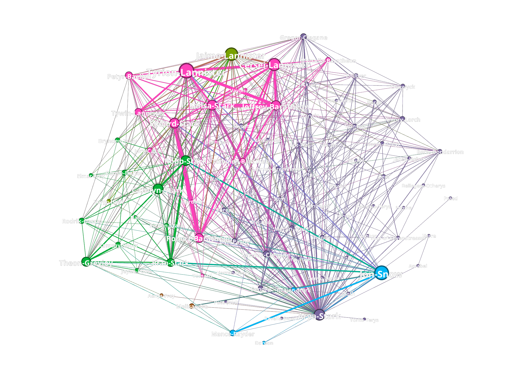
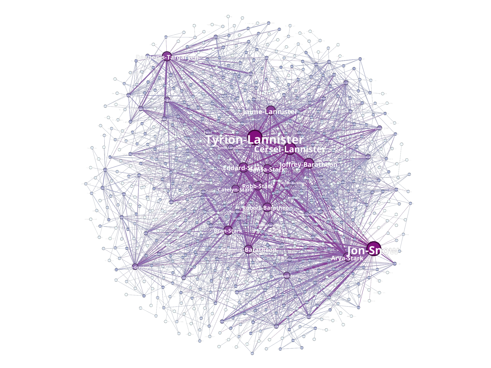
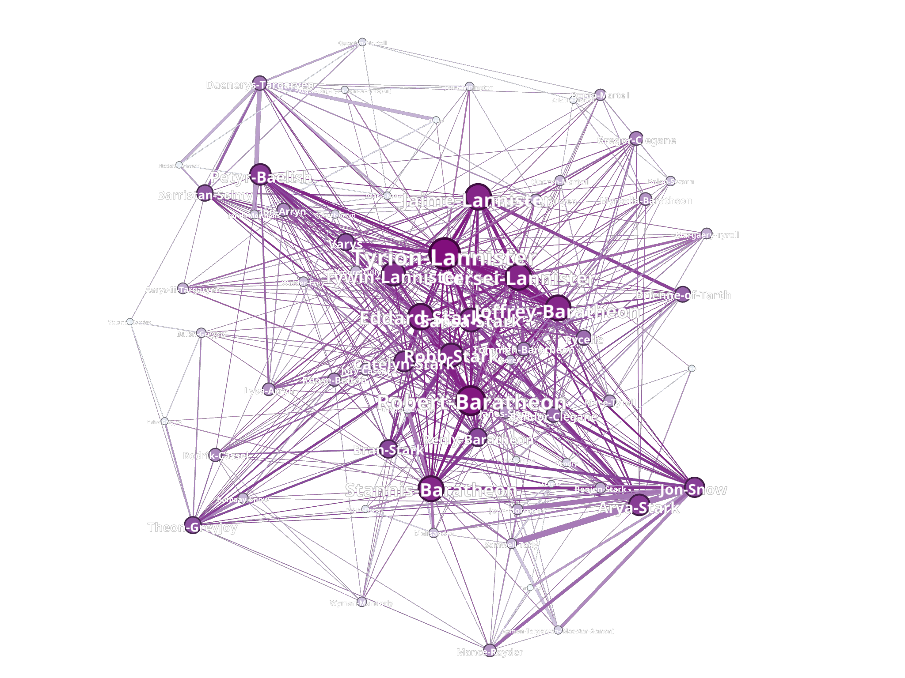

# Teoría de Algoritmos II (75.30)
## Trabajo Práctico Final

[107205 - Eliana Harriet](https://github.com/ElianaHarriet)

### Origen de los datos


Los datos utilizados para la realización del trabajo práctico fueron obtenidos del repositorio de GitHub [mathbeveridge/asoiaf](https://github.com/mathbeveridge/asoiaf/blob/master/data/asoiaf-all-edges.csv). Puntualmente, se utilizó el csv que genera el grafo con todas las aristas a lo largo de todos los libros de la saga (exactamente el archivo al que dirige el link).  
Tal como dice el README del repositorio, una arista conecta dos personajes cada vez que sus nombres (o apodos) aparecían con una diferencia de hasta 15 palabras entre sí en uno de los libros de "Canción de hielo y fuego". El peso de la arista corresponde al número de interacciones.  

### A song of ice and fire
A Song of Ice and Fire es una saga de novelas de fantasía épica escrita por el autor estadounidense George R. R. Martin. Si bien la saga se encuentra inconclusa, hasta el momento el tronco principal de la historia se compone de 5 libros: A Game of Thrones, A Clash of Kings, A Storm of Swords, A Feast for Crows y A Dance with Dragons. A lo largo de dichos libros se narra una historia en donde hubo lugar a muchos giros importantes en la historia, como cambios de bando, asesinatos, traiciones y demas eventos que permite una red de personajes lo suficientemente compleja como para ser analizada.  


### Objetivo
La saga de A Song of Ice and Fire cuenta con una gran cantidad de personajes y sucesos, derivando en una baja probabilidad de preveer que sucederá en el futuro. Sin embargo, es posible analizar la red de personajes y sus interacciones para obtener información sobre la misma.  
De esta forma, el objetivo del trabajo práctico es analizar la red de personajes de la saga a fin de obtener información relevante ya sea a modo compañamiento de la lectura de los libros o para obtener información extra que pudo haber pasado desapercibida.

> **Aviso de Spoilers**: El trabajo práctico contiene información sobre los libros de la saga, por lo que se recomienda no leerlo si no se leyeron todos los libros publicados hasta el momento.

---

## Análisis de la red de personajes


Se trata de un grafo no dirigido con 796 nodos (personajes) y 2823 aristas (apariciones cercanas en los libros). Además, la densidad de la red es de 0.009, lo cual nos demuestra que la red es bastante dispersa.  

Al momento de calcular información respectiva a los grados del grafo se puede obtener lo siguiente:
```
 -> Minimum degree: 1
 -> Maximum degree: 122
 -> Average degree: 7.093
 -> Median degree: 3.0
```
Se puede observar que el grado promedio es mayor al grado mediano, lo que indica que la distribución de los grados no es simétrica. Esto significa que la mitad de los nodos tienen un grado menor o igual a 3, lo cual es bastante bajo y, sumado a que el promedio de grados es de 7, se puede ver la disparidad entre las conexiones de los personajes.  

El diámetro de la red es de 9, algo llamativo para una red tan grande de personajes. En los libros se plantea que el mundo es muy grande y que los personajes se encuentran muy lejos unos de otros (lo cual se condice con la densidad obtenida), además de aparentar tener burbujas bastante aisladas y tenemos el dato recién obtenido sobre la gran cantidad de nodos poco conectados. Sin embargo, el diámetro de la red es muy bajo, lo que indica que cada conexión en sí adquiera mayor importancia, permitiendo que la información viaje de un lado a otro con relativa facilidad.  

## Las casas de Westeros y agrupaciones de personajes


### Análisis de clusters en la red

Al principio de la saga se nos plantean distintas casas, cada una con sus características, fortalezas, miembros ubicaciones y alianzas. Uno podría pensar que las casas son un grupo de personajes que se encuentran muy conectados entre sí, pero la realidad es que no es así, a medida que avanza la historia la única constante es ir perdiendo o separando miembros de las casas. Esto último puede verse en el siguiente gráfico:  


El grafo presentado es un grafo coloreado según el cluster al que pertenece cada personaje, siendo la cantidad de grupos y el grupo a asignar determinado por el algoritmo de Louvain (hecho mediante herramientas de gephi).  
La gran cantidad de colores no sorprende, en principio uno puede pensar que se debe a la gran cantidad de personajes que la saga presenta, o a la extensión del mapa sobre el que ocurre. Pero viendo un poco más allá, no sólo se ven los personajes agrupacos por cercanía a lo largo de la historia, sino que también se puede ver como cada color puede representar un centro importante sobre el que se desarrolla la historia.  

La siguiente es una lista de los nodos más importantes por grupo:
```
Number of groups: 15
Average number of nodes per group: 53.067
Max number of nodes per group: 197
Min number of nodes per group: 2
::Groups::
Group 1 (53 nodes)
        Top 10 nodes:
         - Jaime-Lannister
         - Brienne-of-Tarth
         - Randyll-Tarly
         - Addam-Marbrand
         - Podrick-Payne
         - Vargo-Hoat
         - Hyle-Hunt
         - Cleos-Frey
         - Shagwell
         - Lyle-Crakehall
Group 2 (197 nodes)
        Top 10 nodes:
         - Tyrion-Lannister
         - Cersei-Lannister
         - Sansa-Stark
         - Eddard-Stark
         - Joffrey-Baratheon
         - Robert-Baratheon
         - Tywin-Lannister
         - Petyr-Baelish
         - Varys
         - Tommen-Baratheon
Group 3 (114 nodes)
        Top 10 nodes:
         - Jon-Snow
         - Samwell-Tarly
         - Mance-Rayder
         - Jeor-Mormont
         - Aemon-Targaryen-(Maester-Aemon)
         - Janos-Slynt
         - Eddison-Tollett
         - Bowen-Marsh
         - Pypar
         - Tormund
Group 4 (87 nodes)
        Top 10 nodes:
         - Daenerys-Targaryen
         - Barristan-Selmy
         - Jorah-Mormont
         - Hizdahr-zo-Loraq
         - Drogo
         - Quentyn-Martell
         - Daario-Naharis
         - Irri
         - Viserys-Targaryen
         - Belwas
Group 5 (66 nodes)
        Top 10 nodes:
         - Arya-Stark
         - Sandor-Clegane
         - Gregor-Clegane
         - Ilyn-Payne
         - Meryn-Trant
         - Amory-Lorch
         - Oberyn-Martell
         - Gendry
         - Beric-Dondarrion
         - Yoren
Group 6 (134 nodes)
        Top 10 nodes:
         - Catelyn-Stark
         - Robb-Stark
         - Theon-Greyjoy
         - Bran-Stark
         - Rodrik-Cassel
         - Roose-Bolton
         - Asha-Greyjoy
         - Edmure-Tully
         - Ramsay-Snow
         - Luwin
Group 7 (65 nodes)
        Top 10 nodes:
         - Stannis-Baratheon
         - Renly-Baratheon
         - Davos-Seaworth
         - Melisandre
         - Selyse-Florent
         - Wyman-Manderly
         - Shireen-Baratheon
         - Axell-Florent
         - Cressen
         - Godry-Farring
Group 8 (21 nodes)
        Top 10 nodes:
         - Doran-Martell
         - Arianne-Martell
         - Areo-Hotah
         - Arys-Oakheart
         - Tyene-Sand
         - Garin-(orphan)
         - Obara-Sand
         - Andrey-Dalt
         - Sylva-Santagar
         - Gerold-Dayne
Group 9 (11 nodes)
        Top 10 nodes:
         - Alleras
         - Pate-(novice)
         - Armen
         - Leo-Tyrell
         - Mollander
         - Roone
         - Marwyn
         - Walgrave
         - Gormon-Tyrell
         - Quill
Group 10 (32 nodes)
        Top 10 nodes:
         - Victarion-Greyjoy
         - Aeron-Greyjoy
         - Balon-Greyjoy
         - Euron-Greyjoy
         - Rodrik-Harlaw
         - Moqorro
         - Nute
         - Hotho-Harlaw
         - Baelor-Blacktyde
         - Red-Oarsman
Group 11 (3 nodes)
        Nodes:
         - Gared
         - Waymar-Royce
         - Will-(prologue)
Group 12 (2 nodes)
        Nodes:
         - Horas-Redwyne
         - Hobber-Redwyne
Group 13 (2 nodes)
        Nodes:
         - Florian-the-Fool
         - Jonquil
Group 14 (7 nodes)
        Nodes:
         - Gerold-Hightower
         - Arthur-Dayne
         - Lewyn-Martell
         - Oswell-Whent
         - Jonothor-Darry
         - Smiling-Knight
         - Simon-Toyne
Group 15 (2 nodes)
        Nodes:
         - Nyessos-Vhassar
         - Malaquo-Maegyr
```

- El grupo 1 se caracteriza por ser personajes de la zona de los ríos, en donde se desarrolla la historia de Jaime Lannister y Brienne de Tarth. Entre ellos, se pueden ver personajes de Harrenhal, lugar en donde se desarrolla uno de los puntos más críticos de Jaime y Brienne.  
- El grupo 2 se caracteriza por ser personajes de Desembarco del Rey, en donde se desarrolla la historia de la casa Lannister y la casa Baratheon. Es un grupo muy extenso debido a la alta cantidad de personajes que se encuentran en la capital, de los cuales muchos son de importancia y se encuentran asentados sin moverse por los siete reinos.  
- El grupo 3 se caracteriza por ser personajes de la Guardia de la Noche, en donde se desarrolla la historia de Jon Snow. Es un grupo relativamente extenso debido a la alta cantidad de personajes que se encuentran en el Muro y más allá del mismo. Si bien sus personajes no se mantienen en el muro debido a la expedición de Jon Snow, se puede ver como muchos de ellos se mantienen en el grupo debido a su relación con el mismo o por moverse en conjunto.  
- El grupo 4 se caracteriza por ser personajes de Essos, en donde se desarrolla la historia de Daenerys Targaryen. Si bien es un grupo má extenso que el promedio, no llega a ser tan grande como los anteriores debido a la larga travesía que emprende Daenerys, además de los asesinatos y traiciones que terminan por modificar sucesivamente al grupo.  
- El grupo 5 se caracteriza por ser personajes de distintas partes, muchos del centro-norte de Westeros, en donde se desarrolla la historia de Arya Stark. Si bien es un grupo de personajes en constante movimiento, es un grupo que casualmente vuelve a conectar a algunos de sus personajes a lo largo de la historia, o incluso conecta parsonajes con conocidos en común cerrando triángulos de forma muy particular.  
- El grupo 6 se caracteriza por ser personajes del norte de Westeros, en donde se desarrolla la historia de la casa Stark. Es un grupo extenso debido a que se trata de la coalición de Robb Stark, en donde se encuentran personajes de distintas casas que se unen a la causa de Robb como rey en el norte.  
- El grupo 7 se caracteriza por ser personajes de Rocadragón, en donde se desarrolla la historia de otra parte de la casa Baratheon, en particular de Stannis Baratheon. Es un grupo caracterizado por seguir a Stannis debido a ser la coalición de Stannis como rey de los siete reinos. A diferencia del grupo anterior, esta coalición no es muy diversa en casas y no tiene gran relación con personajes del exterior a menos que se trate de personajes que se unan o relacionen con Stannis.  
- El grupo 8 se caracteriza por ser personajes de Dorne, en donde se desarrolla la historia de la casa Martell. Es un grupo pequeño debido a que la casa Martell no tiene gran relación con el resto de las casas, y se encuentra en una posición geográfica que la mantiene aislada del resto de los reinos. Además, no aparece mucho tiempo en la historia.  
- El grupo 9 se caracteriza por ser personajes de la Ciudadela, en donde se desarrolla la historia de Samwell Tarly.  
- El grupo 10 se caracteriza por ser personajes de las Islas del Hierro, en donde se desarrolla la historia de la casa Greyjoy. Es un grupo que une a una única casa y sus aliados más cercanos, por lo que no es un grupo extenso.
- El grupo 11 se caracteriza por ser personajes de la Guardia de la Noche, particularmente son los tres personajes del prólogo del primer libro.  
- Del grupo 12 al 15 se caracterizan por ser personajes de la historia de Westeros, pero que no tienen gran relación con el resto de los personajes debido a ser personajes chicos que no tienen gran importancia en la historia.

Para ver la relación entre clusters, y dar mejor contexto a lo recién explicado, se hizo un nuevo grafo resultante de convertir a cada grupo en un nodo y conectarlos entre sí. Para el peso de las aristas se utilizó la suma de los pesos de las aristas que conectan a los nodos de cada grupo. El resultado es el siguiente:  

En lugar de numerar los grupos, se puso como nombre del nodo al personaje con mayor cantidad de interacciones del grupo. Además, el grafo está presentado de forma que los vértices más anchos son los que tienen mayor peso y los nodos más grandes son los que tienen mayor grado.  

En esta versión del grafo se puede ver como un grupo de vértices tienen medida similar, esta se corresponde con la métrica de eigenvecor centrality, la cual es una medida de prestigio e influencia de un determinado nodo por sobre la red.  
Se puede ver que, si bien el grupo de los Lannister es el que tiene mayor grado, no es el que tiene mayor prestigio, sino que hay un conjunto de grupos con prestigio semejante. Esto permite que la historia continúe sin tener un grupo de personajes que se destaque por sobre el resto o que tenga mayor _suerte_ en el resultado de sus movimientos, sino que se trata de una red compleja en donde cada personaje y grupo tiene su importancia y su influencia en la historia sin haber un claro ganador del trono de hierro.

### Análisis particular: Los hermanos Stark

Para ver un poco más en detalle, vamos a analizar la primer casa que nos presentan en la saga, los Stark:
Esta casa es una familia noble del norte de Westeros, que gobierna en Invernalia y cuyo emblema es un lobo huargo. Dada la ubicación de la misma, se podría pensar que los miembros de la misma se encuentran muy conectados entre sí y desconectados del resto de los personajes, dado lo lejos que se encuentran de la capital y lo fuerte que resulta el invierno en el norte. Sin embargo, esto no es así, y tomaremos como ejemplo a los hermanos Stark:
- Robb Stark: es el hijo mayor de Eddard Stark y Catelyn Tully. Es el heredero de Invernalia y el Norte.
- Sansa Stark: es la segunda hija de Eddard Stark y Catelyn Tully.
- Arya Stark: es la tercera hija de Eddard Stark y Catelyn Tully.
- Bran Stark: es el cuarto hijo de Eddard Stark y Catelyn Tully.
- Rickon Stark: es el hijo menor de Eddard Stark y Catelyn Tully.
- Jon Snow: en principio es el hijo bastardo de Eddard Stark y una mujer desconocida.  

Al momento de ubicar a estos seis hermanos en el grafo podemos verlos de la siguiente forma:  
  
En donde el ancho de la arista representa la cantidad de interacciones entre los personajes y el color del nodo es el cluster al que pertenece.  
Se puede ver cómo los seis hermanos están en cuatro clusters distintos, lo cual nos indica que no se encuentran muy conectados entre sí. Además, se puede ver que algunas aristas son bastante delgadas, lo cual nos indica que no se encuentran muy conectados algunos pares de hermanos entre sí.  
Siguiendo sobre la trayectoria de estos hermanos, vamos a mencionar un punto clave al principio de la historia: la muerte de Eddard Stark y cómo llegaron los hermanos a la misma:  
Tras la visita del rey Robert Baratheon a Invernalia, Eddard Stark es nombrado Mano del Rey y se ve obligado a viajar a Desembarco del Rey junto a sus hijas Sansa y Arya. Por otro lado, Jon Snow se une a la Guardia de la Noche y se dirige al Muro. Robb, Bran y Rickon se quedan en Invernalia, Robb debido a que es el heredero de Invernalia y el Norte, y Bran y Rickon por ser muy jóvenes. Esto nos deja con los siguientes clusters:
- Arya y Sansa en Desembarco del Rey
- Bran, Rickon y Robb en Invernalia
- Jon Snow en el Muro  

Pero tras la muerte de Eddard Stark, la posición de Arya y Sansa se ve comprometida, por lo que Arya se ve obligada a huir de Desembarco del Rey y Sansa queda prisionera de la familia Lannister. La casa Stark intentará a lo largo de la historia recuperar a sus hijas, sin embargo este grafo es una clara demostración de cómo no sólo no fue posible, sino que además las hermanas se fueron separando cada vez más. Veamos las conexiones de cada una de ellas:  

Este es el grafo de conexiones de Sansa Stark, en donde se puede ver que sus conexiones pertenecen mayoritariamente a un mismo cluster, lo cual nos indica que se encuentra muy conectada a un grupo de personajes en particular. Entre estos personajes, se puede ver una mayor presencia de personajes de la casa Lannister, lo cual se condice con la situación de Sansa en Desembarco del Rey y muestra como el retorno a su familia es un hecho con cada vez menos posibilidades debido al poco poder que tiene por sobre su entorno.  

Este es el grafo de conexiones de Arya Stark, en donde se puede ver que sus conexiones se encuentran más dispersas que las de Sansa, en estas conexiones se puede ver una buena cantidad de personajes de Westeros, pero muchos otros de Essos, lo cual se condice con la situación de Arya, que tras la muerte de su padre se ve obligada a huir de Desembarco del Rey y ronda por Westeros y luego Essos. Además, se puede ver como muchos de los personajes tienen un grado bajo, lo cual indica que no son personajes muy importantes en la historia, lo cual se condice con la situación de Arya, que se encuentra huyendo de los Lannister y no tiene un lugar fijo en el mundo.  

Respecto a cada una de las subredes, vamos a eliminar a Sansa y Arya de ambas para realizar algunos cálculos:

|                                     | Entorno de Sansa | Entorno de Arya |
|-------------------------------------|------------------|-----------------|
| **Grado medio**                     | 11.865           | 8.819           |
| **Grado medio con pesos**           | 264.919          | 183.012         |
| **Diámetro de la red**              | 4                | 5               |
| **Densidad de la red**              | 0.163            | 0.108           |
| **Coeficiente medio de clustering** | 0.712            | 0.617           |
| **Longitud media de camino**        | 2.117            | 2.191           |

Con estas métricas se pueden notar dos diferencias cruciales entre ambas redes:

- **Importancia de los nodos** (métricas a tener en cuenta: grado medio, grado medio con pesos)  
Viendo los grados promedio de ambas redes se ve una diferencia muy grande, siendo los personajes del entorno de Sansa unos personajes de gran importancia. Esto puede traducirse a personajes con relativo gran poder, al ver los nombres se puede ver que en su mayoría son Lannisters, lo cual valida la hipótesis. De esta forma, se puede ver que el entorno de Sansa es un entorno de personajes peligroso en el cual cada decisión que tome Sansa puede ser crucial para su futuro y la supervivencia a lo largo de la historia.  
Es una gran diferencia con las métricas para el entorno de Arya, en donde se puede ver un grado promedio mucho más bajo, pudiendo entonces dar más posibilidades a Arya de influir en su entorno y tomar decisiones más asertivas.  
- **Conectividad** (métricas a tener en cuenta: diámetro de la red, densidad de la red, coeficiente medio de clustering, longitud media de camino)
En estas métricas no hay diferencias tan grandes como las anteriores, pero se puede destacar la diferencia en el coeficiente medio de clustering. Ésta métrica es más baja en el entorno de Arya, lo cual nos permite pensar que es más probable que Arya se encuentre con personajes que no se conocen entre sí, lo cual, sumado al resto de métricas, va a permitir que Arya se mueva con mayor facilidad por el mundo sin encontrarse con personajes que puedan reconocerla. De esta forma, de cometer un error es más probable que Arya pueda escapar de sus consecuencias directas sobre el entorno cercano.  

Sumando ambas características, se puede ver que el entorno de Sansa se caracteriza por tener un grueso de personajes de alta importancia, mientras que el entorno de Arya se caracteriza por poder moverse entre los hilos de la historia pudiendo no ser reconocida por los personajes que se encuentre. Es así como Sansa termina siendo un títere de su entorno, teniendo que meditar sin mucho éxito cada movimiento, mientras que Arya resulta un ser más libre que a lo largo de la historia aprende a jugar con los pesos de su entorno manejando cada peligro que se le presenta.  

## Análisis de los personajes individualmente

### Métricas sobre el grafo completo

Al momento de analizar los personajes individualmente hay distintas métricas a tomar en cuenta. En principio, se puede analizar el grado de cada personaje, lo cual nos indica la cantidad de interacciones que tiene el personaje con otros personajes, pero no nos indica la importancia de los personajes con los que interactúa o si estos personajes a su vez pueden estar conectados a otros de importancia y contribuir a la influencia del personaje en cuestión.   
Para esto, se pueden analizar distintas métricas de centralidad e importancia. En particular, se analizarán distintas métricas de forma gráfica directamente sobre la red, y luego se analizará más a fondo aquellos personajes que se destaquen en las métricas.  

**::Grados::**  
El grado de un nodo es la cantidad de aristas que lo conectan con otros nodos. En el caso de la red de personajes, el grado de un personaje es la cantidad de interacciones que tiene con otros personajes.

Se puede ver como destacan los siguientes personajes:
1. Tyrion Lannister
2. Jon Snow
3. Jaime Lannister
4. Cersei Lannister
5. Stannis Baratheon
6. Arya Stark
7. Catelyn Stark
8. Eddard Stark
9. Sansa Stark
10. Robb Stark

**::Grados con pesos::**  
El grado con pesos de un nodo es la suma de los pesos de las aristas que lo conectan con otros nodos. En el caso de la red de personajes, el grado con pesos de un personaje es la suma de las interacciones que tiene con otros personajes.

Se puede ver como destacan los siguientes personajes:
1. Tyrion Lannister
2. Jon Snow
3. Cersei Lannister
4. Joffrey Baratheon
5. Edddard Stark
6. Daenerys Targaryen
7. Jaime Lannister
8. Sansa Stark
9. Bran Stark
10. Robert Baratheon

Aquí sorprende cómo es que aparece Bran, pero al analizarlo más a fondo se puede ver que es debido a que Bran tiene una gran cantidad de interacciones con los personajes de su entorno, pero no tiene interacciones con personajes de otros entornos. 

**::Betweenness centrality::**  
Es una medida de centralidad en un grafo basada en los caminos más cortos, esta medida para cada nodo es la cantidad de caminos más cortos que pasan por el mismo.  
  
Se puede ver como destacan los siguientes personajes:
1. Jon Snow
2. Tyrion Lannister
3. Daenerys Targaryen
4. Theon Greyjoy
5. Stanis Baratheon
6. Jaime Lannister
7. Cersei Lannister
8. Arya Stark
9. Eddard Stark
10. Robert Baratheon

Estos personajes se destacan por ser personajes que se mueven mucho a lo largo de la historia, y que además tienen un rol importante en la misma. Las únicas excepciones son Theon Greyjoy y Cersei Lannister, que si bien no se mueven tanto como los demás, tienen un rol importante en la historia.  

**::Eigenvector centrality::**  
Es una medida de influencia de un nodo en una red. Los puntajes relativos se asignan a todos los nodos de la red en base al concepto de que las conexiones a nodos de alto puntaje contribuyen más al puntaje del nodo en cuestión que las conexiones iguales a nodos de bajo puntaje. Un puntaje alto de eigenvector significa que un nodo está conectado a muchos nodos que a su vez tienen puntajes altos.  

Se puede ver como destacan los siguientes personajes:
1. Tyrion Lannister
2. Cersei Lannister
3. Jaime Lannister
4. Joffrey Baratheon
5. Sansa Stark
6. Robert Baratheon
7. Eddard Stark
8. Stannis Baratheon
9. Catelyn Stark
10. Robb Stark

Estos personajes se destacan por su alto poder político o militar, en todos los casos son personajes que ocuparon el trono de hierro (Joffrey, Robert), son herederos al mismo o se proclaman rey (Stannis, Robb), tuvieron una fuerte influencia sobre un rey (Cersei, Jaime, Eddard, Catelyn), o son instrumentos de poder (Sansa). En el caso de Tyrion, tiene un alto poder político debido a ser un Lannister, pero además tiene un alto poder militar debido a su rol como estratega y tener muy poco para perder.  

### Métricas sobre un grafo selecto
A continuación se analizarán las métricas sobre un grafo selecto, en particular, los personajes con mayor presencia e importancia en la historia. Para ello se tomaron todas las métricas anteriores para hacer un filtrado de los nodos menos importantes y quedarse con los más relevantes. La idea principal es ver cómo se dan las métricas anteriores dentro de una red de sólo personajes de alta importancia.

**::Grados::**

Se puede ver como destacan los siguientes personajes:
1. Tyrion Lannister
2. Robert Baratheon
3. Cersei Lannister
4. Eddard Stark
5. Jaime Lannister
6. Joffrey Baratheon
7. Stannis Baratheon
8. Robb Stark
9. Sansa Stark
10. Tywin Lannister

**::Grados con pesos::**

Se puede ver como destacan los siguientes personajes:  
1. Tyrion Lannister
2. Cersei Lannister
3. Jon Snow
4. Joffrey Baratheon
5. Eddard Stark
6. Robert Baratheon
7. Sansa Stark
8. Robb Stark
9. Stannis Baratheon
10. Jaime Lannister

**::Betweenness centrality::**

Se puede ver como destacan los siguientes personajes:  
1. Tyrion Lannister
2. Robert Baratheon
3. Stannis Baratheon
4. Jon Snow
5. Eddard Stark
6. Joffrey Baratheon
7. Barristan Selmy
8. Jaime Lannister
9. Daenerys Targaryen
10. Tywin Lannister

**::Eigenvector centrality::**

Se puede ver como destacan los siguientes personajes:  
1. Tyrion Lannister
2. Robert Baratheon
3. Cersei Lannister
4. Jaime Lannister
5. Edddard Stark
6. Joffrey Baratheon
7. Sansa Stark
8. Stannis Baratheon
9. Robb Stark
10. Tywin Lannister

De esta forma podemos sacar las siguientes conclusiones:
- **Tyrion Lannister** es el personaje con más relevancia en la historia, en todas las métricas se encuentra en el primer puesto (con una sóla excepción para BC del grafo completo). Esto demuestra que Tyrion es un personaje con muchos lazos, y que además estos lazos son con personajes de alta relevancia. Sumado a esto, su inteligencia le da un rol de estratega capaz de cambiar el curso de la historia con sus decisiones y de recuperar el rumbo en caso de un cambio de curso inesperado y desfavorable.  
- **Jon Snow** es un personajes con no muchas conexiones de importancia, pero las que tiene son reiteradas a lo largo de la historia (se ve en el cambio de métricas de grados entre el grafo completo y el grafo selecto).
- Los hermanos **Jaime** y **Cersei** son influyentes en la historia, manteniendo un rango de importancia similar a pesar de estar en dos escenarios diferentes. Cersei se encuentra en Desembarco del Rey, mientras que Jaime se encuentra escapando del entorno de Robb Stark como prisionero de guerra protegido por Brienne de Tarth. Esto invita a pensar que no sólo son personajes influyentes, sino que sus situaciones pueden no ser tan diferentes como aparentan: Cersei en realidad es prisionera de su alta posición, sin poder ejercer realmente el poder debido a las consideraciones de su entorno por sobre las mujeres, mientras que Jaime a lo largo de la historia comienza a acomodarse en su posición y ganando libertades a medida que afrenta junto a Brienne los peligros que se le presentan.  
- **Arya Stark** es un personaje muy capaz, esto se ve debido a la gran cantidad de conexiones y avance a lo largo de la historia. Volviéndose un personaje de importancia por mérito propio y no por conexiones de alta importancia. Esto además es una ventaja, ya que tener conexiones de importancia puede resultar peligroso, de esta forma Arya puede moverse con mayor libertad.
- **Sansa Stark** de forma opuesta a Arya, aparece en mayores tops de las métricas. Esto permite ver cómo Sansa es un elemento de la política manejado por su difícil entorno, en donde cada movimiento que hace puede ser crucial para su supervivencia.
- **Catelyn** y **Robb Stark** son personajes que se mantienen en distintos tops de las métricas, pero no en todos. Esto da contexto a las conexiones necesarias para que Robb se convierta en rey en el norte, pero también da contexto a la muerte de Robb y Catelyn, ya que no son personajes que se encuentren en todos los tops de las métricas. Esto permite ver cómo la muerte de Robb y Catelyn es un hecho de alta importancia para sus casas enemigas y el por qué fue planeado con tanto cuidado para evitar _salpicarse_.
- **Stannis Baratheon** es un personaje que se encuentra en los tops de las métricas, pero no en todos. Esto permite ver cómo Stannis es un personaje que se encuentra en una posición de poder, pero que no tiene la influencia suficiente para ser un personaje de mayor importancia. Esto da contexto a por qué le es tan difícil a Stannis conseguir aliados para su causa y acercarse al trono de hierro.
- **Eddard Stark** y **Robert Baratheon** son personajes que se encuentran en los tops de las métricas, pero no en todos. Esto permite ver cómo son personajes que se encuentran en una posición de alto poder, pero efímero. Ya que ambos mueren al principio de la historia, pero sus muertes son el punto de partida de la misma.
- **Joffrey Baratheon**, **Theon Greyjoy** y **Tywin Lannister** son personajes que se encuentran en los tops de las métricas, pero no en todos. Esto se debe a que son personajes que tuvieron poder o influencia en determindos momentos de la historia. En el caso particular de Twin, se puede ver cómo su influencia surge dentro del grafo selecto, esto se debe a que su influencia se da a partir de la muerte de Eddard Stark y por sobre un grupo selecto de personajes (por sobre todo su hija Cersei). Esto permite ver cómo Tywin es un estratega bajo las sombras, muy simliar a Tyrion, pero con una influencia más enfocada sobre los personajes cercanos al trono (incluso fue mano del rey en su momento).
- **Daenerys Targaryen** es un personaje que se encuentra en algunos tops. Esto se debe a que su historia se mantiene alejada de Westeros en la gran mayoria de la historia, incluso muchos no saben su nombre. De esta forma, Daenerys es un personaje de alto poder e influencia sólo dentro de su entorno y ocasionalmente por fuera del mismo.

# ***Beep boop, estoy trabajando en esto*** 👇🏻

## analizar la red según los libros (ver la oportunidad de comparar la evolución entre distintos libros)

## análisis por dentro de un cluster

## análisis siguendo x personajes

## Comparaciones con Erdös-Rényi y Preferential Attachment

## Epidemias en got -> enfermedades, lineas de pensamiento, etc

## deteccion de brotes ??

## epidemias/brotes/otro como deteccion de compartir algo aka aliarse

## evolución de la red -> nuevos enlaces

## cosas de los últimos temas